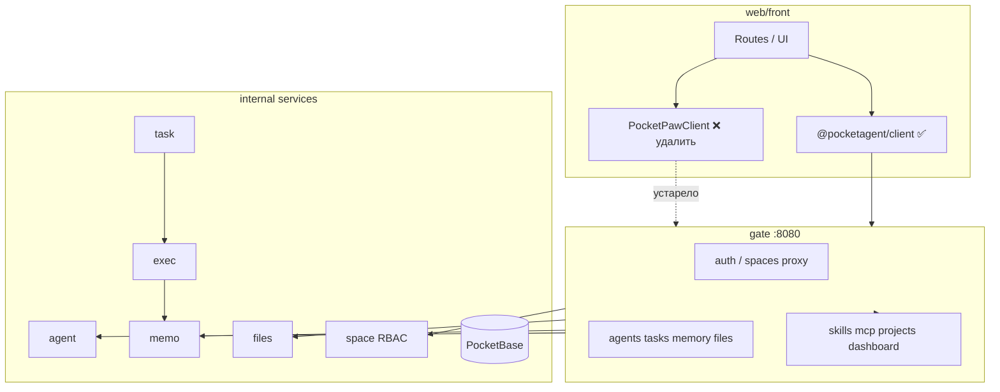
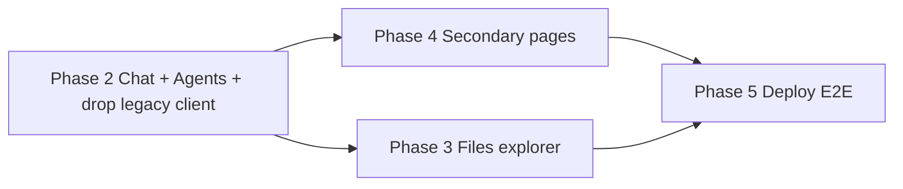

# Web UI — миграция `web/front` → PocketAgent

Обновлено: 14 июля 2026

## Цель

Довести `web/front` (наследие **PocketPaw**) до полноценного UI **PocketAgent**:

1. **Без Tauri** — браузерный SPA ✅
2. **`@pocketagent/client`** + **`gate :8080`** для всего tenant API ✅ (SDK готов)
3. **Убрать `PocketPawClient` и `legacy-facade`** — единственный HTTP-клиент: SDK
4. Подключить страницы к реальному backend (API уже на gate)

---

## Текущий статус

| Слой | Состояние |
|------|-----------|
| **Backend (gate + services)** | ✅ Tenant API для agents, tasks, memory, MCP, skills, projects, files, dashboard |
| **`web/client` (`@pocketagent/client`)** | ✅ Namespaced SDK, без legacy-эндпоинтов |
| **`web/front`** | 🟡 Auth/spaces через SDK; большинство страниц — `connectionStore.getClient()` → legacy stub |

**Главный блокер сейчас — front**, не backend.

---

## Статус фаз

| Фаза | Описание | Статус |
|------|----------|--------|
| **0** | Убрать Tauri, починить сборку | ✅ |
| **1** | SDK, JWT login, space switcher, vite proxy | ✅ |
| **2** | Agents + Tasks + Chat (ядро), удалить legacy client | 🔴 **Следующая** |
| **3** | File explorer → Files API | 🟡 Backend ✅, front — local stub |
| **4** | Secondary pages на SDK | 🟡 Backend ✅, front — legacy вызовы |
| **5** | Deploy, E2E, polish | 🔴 |

---

## Матрица: `web/front` ↔ backend

Легенда: ✅ готово | 🟡 частично | 🔴 не сделано на front

| Route / фича | Backend (gate) | SDK (`web/client`) | Front сейчас | Действие |
|--------------|------------------|--------------------|--------------|----------|
| **Space switcher** | ✅ `space` + proxy | ✅ `client.spaces` | ✅ | — |
| **`/login`** | ✅ JWT | ✅ `client.auth` | ✅ | — |
| **`/chat`** | ✅ tasks + SSE/WS | ✅ `client.tasks`, `TaskStream` | 🔴 `chat.svelte.ts` → legacy | Phase 2 |
| **`/settings`** | ✅ agents CRUD | ✅ `client.agents` | 🟡 legacy settings tabs | Agent editor; убрать channels |
| **`/schedules`** | ✅ `/schedules` | ✅ `client.schedules` | 🔴 нет route | Новая страница |
| **`/memory`** | ✅ `/memory`, search, stats | ✅ `client.memory` | 🔴 `MemoryPanel` → `/memory/long_term` | Phase 4 |
| **`/mcp`** | ✅ `/mcp/servers`, presets | ✅ `client.mcp` | 🔴 `MCPPanel` → `/mcp/add` | Phase 4 |
| **`/explore`** | ✅ skills + `/tools` | ✅ `client.skills`, `client.tools` | 🔴 `/skills/install` | Phase 4 |
| **`/identity`** | ✅ `/agents/:id/identity` | ✅ `client.identity` | 🔴 `GET /identity` | Phase 4 |
| **`/activity`** | ✅ `/spaces/:id/activity` | ✅ `client.activity` | 🟡 только task stream | Phase 4 |
| **`/projects`** | ✅ CRUD + planning + WS | ✅ `client.projects` | 🟡 частично SDK WS | Довести CRUD/planning UI |
| **`/command-center`** | 🟡 `/dashboard`, `/kits` | ✅ `client.dashboard` | 🔴 PawKits YAML | Адаптировать под kits API |
| **`/` explorer** | ✅ Files API | ✅ `client.files` | 🟡 local FS stub | Phase 3 |
| **`/health`** | ✅ `/health` | — | 🟡 legacy health calls | Упростить |
| **`/metrics`** | ✅ Prometheus | — | 🟡 legacy | Упростить |
| **Channels** (settings) | — | — | 🔴 PocketPaw only | Скрыть / удалить |
| **Mission Control panels** | 🟡 overlap tasks/agents | частично | 🔴 MC API 1:1 | Не портировать MC; использовать tasks/agents |

---

## Backend — что уже есть

Не требует доработки для базового UI (см. [README.md](../README.md)).

### Memory (`internal/memo` + gate)

```
GET    /memory              — list (paginated)
POST   /memory              — ingest (gate embeds → memo)
POST   /memory/search       — semantic search
GET    /memory/:id          — get document
DELETE /memory/:id          — delete
GET    /memory/stats        — stats
GET/POST /memory/settings   — settings facade
```

RBAC: `memory:read`, `memory:write`.

### MCP (`internal/space/gate/mcp`)

```
GET/POST        /mcp/servers
GET/PATCH/DELETE /mcp/servers/:id
POST            /mcp/servers/:id/test
GET             /mcp/status
GET             /mcp/presets
POST            /mcp/presets/install
```

PB коллекция `mcp_servers` (per space). Exec загружает MCP per subtask.

### Skills (`internal/space/gate/skills`)

```
GET/POST/PATCH/DELETE /skills
GET  /skills/catalog
POST /skills/:id/run
GET  /tools
```

PB коллекция `skills`.

### Identity (`internal/agent`)

```
GET/PUT /agents/:id/identity
GET     /agents/:id/runtime-config
```

Пять markdown-полей + `user_file` из `space_profiles`. Legacy `GET/PUT /identity` **удалён**.

### Projects + Dashboard

- Projects: CRUD `/projects`, items, planning, `WS /ws/project/:id`
- Dashboard: `GET /dashboard`, kits: `/kits`, `/kits/catalog`, `/kits/:id/data`

### Files (`internal/files` + gate proxy)

- `/files/*`, `/projects/:id/files/*`

### Activity

- `GET /spaces/:id/activity` (space service, через gate с auth)

---

## SDK (`@pocketagent/client`) — готово

Модули (namespaced, без legacy):

```ts
client.auth
client.spaces
client.agents
client.tasks        // + openStream(), schedules в client.schedules
client.schedules
client.memory
client.mcp
client.skills
client.tools
client.identity     // get(agentId), update(agentId, input)
client.activity
client.dashboard
client.projects
client.files
```

Сборка: `cd web/client && bun run build`.

---

## Front — legacy, что удалить

| Файл / паттерн | Проблема |
|----------------|----------|
| `web/front/src/lib/api/client.ts` | `PocketPawClient` со старыми путями (`/identity`, `/memory/long_term`, `/mcp/add`, `/skills/install`) |
| `web/front/src/lib/api/legacy-facade.ts` | Proxy-stub для компиляции немигрированных страниц |
| `connectionStore.getClient()` | Возвращает legacy facade (~30 call sites) |
| `kits.svelte.ts`, `pawkit.ts` | PocketPaw YAML dashboards |

**Целевой паттерн:**

```ts
const client = connectionStore.getAgentClient();
await client.memory.list();
await client.identity.get(agentId);
```

---

## Front — план по фазам

### Фаза 2 — Ядро (следующая) 🔴

- [ ] **2.1** `/agents` UI — `client.agents.*` (list/create/update/delete)
- [ ] **2.2** `chat.svelte.ts` → `client.tasks.create` + `TaskStream` / SSE
- [ ] **2.3** `sessions.svelte.ts` → история через `client.tasks.list`
- [ ] **2.4** `activityStore` ← события из task stream (краткосрочно)
- [ ] **2.5** Удалить `legacy-facade.ts`, `PocketPawClient`, `getClient()` из connectionStore
- [ ] **2.6** Все stores Phase 2 перевести на `getAgentClient()`

### Фаза 3 — Explorer 🟡

- [ ] **3.1** `FsAdapter` → `client.files` (browse, upload, delete)
- [ ] **3.2** Опционально: Browser File System Access API для local mode
- [ ] **3.3** Убрать local-only stub как default при наличии backend

### Фаза 4 — Secondary pages

| Page | SDK | Front задачи |
|------|-----|--------------|
| `/memory` | `client.memory` | Переписать `MemoryPanel` |
| `/mcp` | `client.mcp` | `MCPPanel` → servers CRUD + presets |
| `/explore` | `client.skills`, `client.tools` | Skills + Tools tabs |
| `/identity` | `client.identity` | Agent picker + `get/update(agentId)` |
| `/activity` | `client.activity` | Space-wide feed |
| `/projects` | `client.projects` | CRUD + planning UI |
| `/command-center` | `client.dashboard` | Kits вместо PawKits YAML |
| `/schedules` | `client.schedules` | Новый route |
| `/settings` | `client.agents`, spaces | Убрать channels/AI backends |

- [ ] **4.1** `disabled-features.ts` — флаги до завершения миграции страницы
- [ ] **4.2** Sidebar: badge «Soon» только там, где UI ещё на stub
- [ ] **4.3** Удалить `kits.svelte.ts` / `pawkit.ts` после command-center

### Фаза 5 — Deploy

- [ ] Docker `web` service или static deploy за gate
- [ ] `make web-dev` в корневом Makefile
- [ ] Playwright E2E против gate
- [ ] Документация API (OpenAPI) — опционально

---

## Сопоставления (актуальные)

### Space ≠ Projects

| | **Space** | **Projects** |
|---|-----------|--------------|
| Смысл | Tenant / RBAC boundary | Долгоживущая цель, planning, kanban items |
| Backend | `spaces`, `space_members` | ✅ `projects` в PocketBase + gate API |
| Front | `connectionStore.spaces` | `projectStore` — довести до SDK |

### Memory

Front `MemoryPanel` ожидал flat-массив `MemoryEntry[]` с `timestamp`. Backend отдаёт:

```json
{ "documents": [{ "id", "content", "tags", "created_at", "metadata" }], "total", "page", "per_page" }
```

Адаптер в UI: map `created_at` → display, delete по `id` через `client.memory.delete(id)`.

### MCP

Front использовал name-based toggle/remove. Backend — ID-based CRUD. UI: список через `client.mcp.list()`, toggle через `client.mcp.patch(id, { enabled })`.

### Skills

Front: install by `identifier` → SDK: `client.skills.catalog()` + `client.skills.create({ ..., catalog_id })`, или helper в UI-слое (не в SDK).

### Identity

Front: global `GET /identity` → SDK: выбрать агента, `client.identity.get(agentId)` / `update(agentId, files)`.

### Activity

Краткосрочно: события активной задачи из stream (Phase 2).  
Целевое: `client.activity.list()` для space-wide ленты.

### Command Center

PawKits YAML → gate `/kits` + `/dashboard`. Панели: agents, tasks, metrics из SDK; не портировать MC API 1:1.

---

## Архитектура



---

## Порядок работ



Backend не блокирует Phase 2 и 4 — API готов. Параллельно можно вести Phase 3 (files).

---

## Критерии готовности

### Web MVP (после Phase 2)

- [x] Login, space switcher, gate health
- [ ] Agents CRUD UI на SDK
- [ ] Task create + live stream в chat
- [ ] Activity из task events
- [ ] Нет `PocketPawClient` / `legacy-facade` в репозитории

### Web v1.0 (после Phase 4)

- [ ] `/memory`, `/mcp`, `/explore`, `/identity`, `/activity` на SDK
- [ ] `/projects`, `/command-center` на kits/dashboard API
- [ ] `/schedules` UI
- [ ] Explorer на Files API (или явный offline mode)
- [ ] Channels / PocketPaw settings удалены или скрыты

---

## Быстрый старт

```bash
# Backend
make up
docker compose exec ollama ollama pull llama3.1
docker compose exec ollama ollama pull nomic-embed-text

# SDK
cd web/client && bun install && bun run build

# Front
cd web/front && cp .env.example .env && bun install && bun run dev
# Proxy: VITE_GATE_URL= (пустое) — vite проксирует на gate
```

---

## Ссылки

- [README.md](../README.md) — архитектура backend, порты, API surface
- Gate routes: [`internal/gate/apis/routes.go`](../internal/gate/apis/routes.go)
- Space gate (skills, mcp, projects): [`internal/space/gate/`](../internal/space/gate/)
- Memo gate API: [`internal/memo/apis/`](../internal/memo/apis/)
- SDK: [`web/client/src/lib/`](../web/client/src/lib/)
- Front: [`web/front/src/`](../web/front/src/)